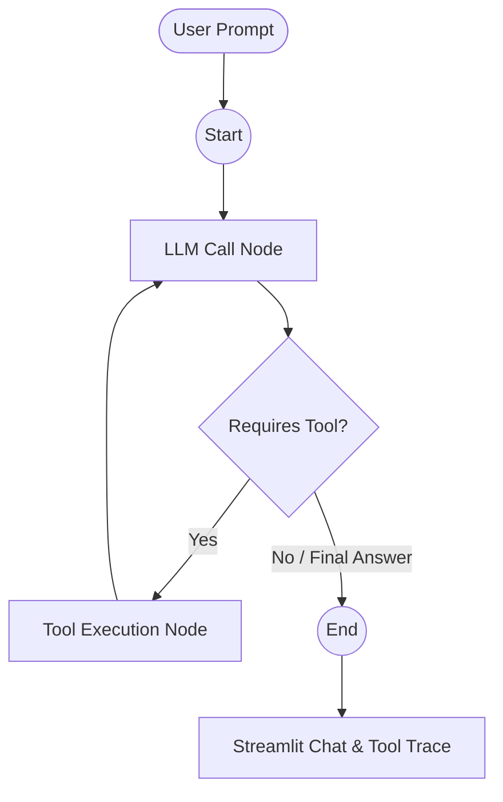
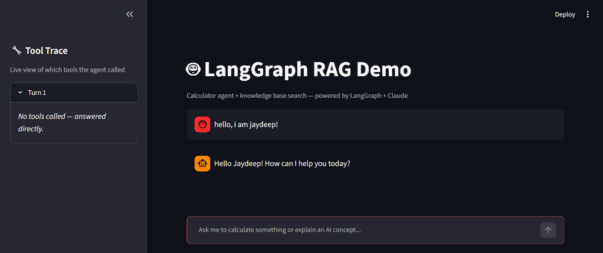
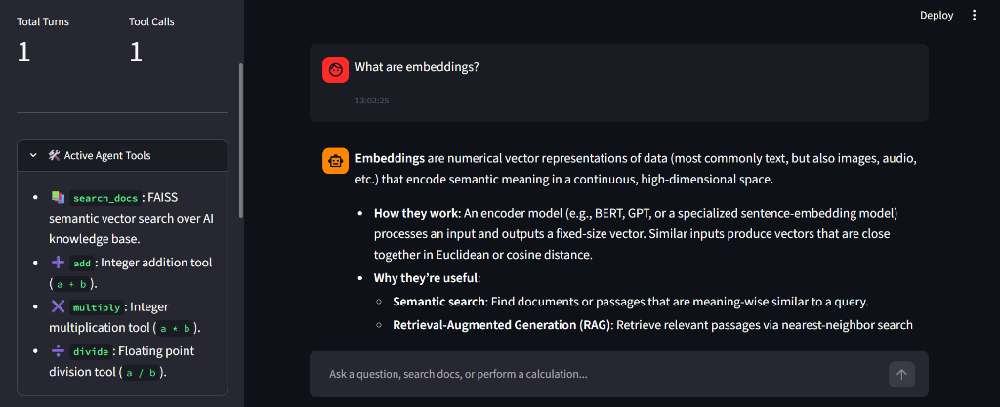
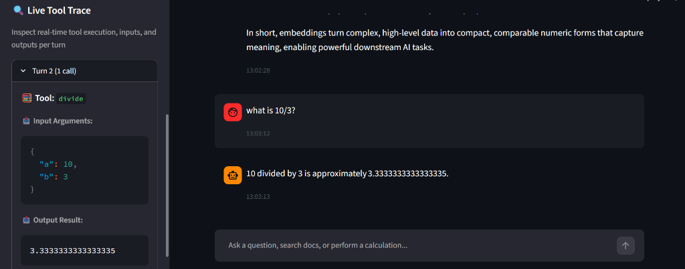
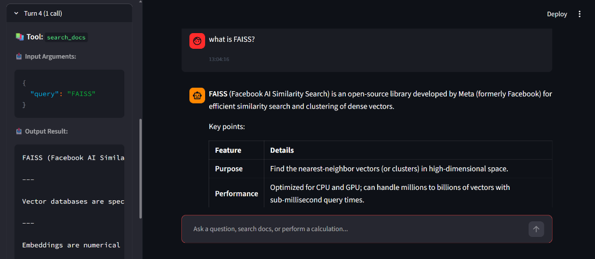

# 🤖 LangGraph RAG Agent & Streamlit Demo

A stateful AI Agent combining **Retrieval-Augmented Generation (RAG)** and **Tool Execution (Calculations & Knowledge Retrieval)** built with **LangGraph**, **LangChain**, **Groq**, **FAISS**, and **Streamlit**.

---

## ✨ Features

- **🧠 Stateful Agent (LangGraph)**: Built using `StateGraph` with custom nodes for LLM reasoning, dynamic tool selection, and state management.
- **📚 Local Document Search (RAG)**: FAISS vector database indexed with Google Generative AI Embeddings (`models/gemini-embedding-001`) for semantic search over AI/ML concepts.
- **🧮 Math & Utility Tools**: Custom agent tools for arithmetic calculations (`add`, `multiply`, `divide`).
- **🖥️ Streamlit Web Interface**: 
  - Real-time interactive chat display.
  - Live **Tool Trace Sidebar** showing exact tool calls, arguments, and execution outputs per turn.
- **⚡ Powered by Groq**: Ultra-fast LLM inference via `ChatGroq`.

---

## 🏗️ Architecture & Agent Flow



---

## 📁 Project Structure

```text
RAG+LangGraph_Project/
├── app.py              # Streamlit UI application with live tool tracking
├── agent.py            # LangGraph agent definition & custom tools
├── ingest.py           # Script to chunk documents & build FAISS vector index
├── assets/             # Streamlit UI screenshots & demo media
├── sample_docs/        # Knowledge base text files (e.g. ai_context.txt)
│   └── ai_context.txt
├── faiss_index/        # Generated local FAISS vector store
├── pyproject.toml      # Project dependencies & configuration
├── .env.example        # Environment variable template
└── README.md           # Project documentation
```

---

## 🖼️ Application Screenshots & Demo

Here is the Streamlit web interface in action, showcasing the stateful agent with live tool tracing, document search (RAG), and mathematical tool executions:

### 1. Direct Conversational Response


### 2. RAG Semantic Document Search (`search_docs`)


### 3. Custom Math & Utility Tool Execution (`divide`)


### 4. FAISS Knowledge Retrieval & Markdown Rendering


---

## 🚀 Quick Start

### 1. Prerequisites
- Python `>= 3.11`
- [uv](https://github.com/astral-sh/uv) (recommended) or standard `pip`

### 2. Clone Repository
```bash
git clone https://github.com/Jaydeep0832/RAG-LangGraph.git
cd RAG-LangGraph
```

### 3. Setup Virtual Environment & Install Dependencies
Using `uv`:
```bash
uv sync
```
Or using standard `pip`:
```bash
python -m venv .venv
source .venv/bin/activate  # On Windows: .venv\Scripts\activate
pip install -r pyproject.toml
```

### 4. Configure Environment Variables
Copy `.env.example` to `.env` and fill in your API keys:
```bash
cp .env.example .env
```
Add your keys inside `.env`:
```env
GOOGLE_API_KEY="your_google_ai_studio_key"
GROQ_API_KEY="your_groq_api_key"
```

---

## 📖 Usage

### Step 1: Ingest Documents into FAISS
Build the local vector index from documents in `sample_docs/`:
```bash
uv run python ingest.py
```

### Step 2: Run Streamlit Web Application
Launch the interactive agent interface:
```bash
uv run streamlit run app.py
```
Open your browser at `http://localhost:8501`.

---

## 🛠️ Tech Stack

- **Framework**: LangGraph, LangChain Core
- **LLM**: Groq (`ChatGroq`)
- **Embeddings**: Google Generative AI Embeddings (`gemini-embedding-001`)
- **Vector Store**: FAISS (Facebook AI Similarity Search)
- **UI**: Streamlit
- **Package Manager**: UV

---

## 🤝 Contributing

Contributions, issues, and feature requests are welcome! Feel free to check the [issues page](https://github.com/Jaydeep0832/RAG-LangGraph/issues).